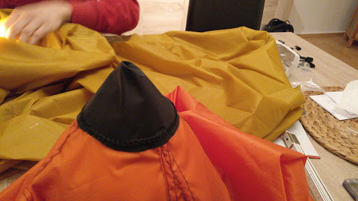
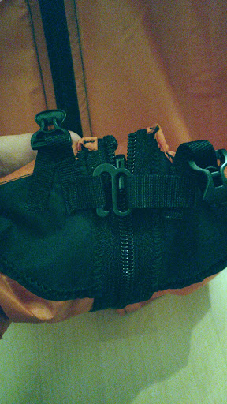
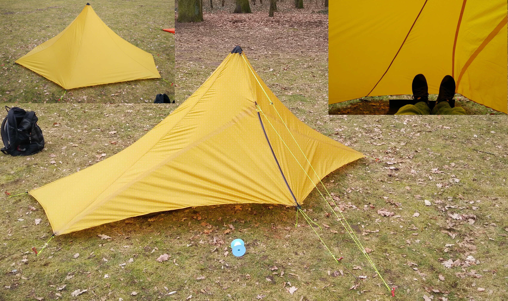

# The Mid
This project was our first fully CAD based design. 
As a little conclusion, designing with CAD-software is much more joy than sitting on your knees with redrawing lines over and over again.

## Design Phase
The first design was done in [Sketchup](https://www.sketchup.com/).
It was a good and fast way to get an idea of the look and dimensions.
We also took the dimensions and angles form that design.
    

With these dimensions we started to put together our design in [Valentina](http://valentina-project.org/).
Valentina is an open source pattern making tool which got a very active and helpful community behind it.
Despite, Valentina was not designed for tent pattern it serves you some very handy features like curves to design perfect catenary cuts and a well thought work flow form constructing the parts over seam allowance calculation to printing.

For printing we used a rather old 61cm cut plotter which we supplied with a pen. 
A much faster and more easy way is to use the Inkjet plotter of the next copy shop.
But buying tents is also much faster and more easy and we do not do that either.
Here a little impression of that process:

As this was our first try on catenary cuts with Valentina we did a little validation with our former catenary cut design tool.
The result: there was no difference between them.

## Sewing
After cutting all parts and sewing them from bottom to top of the tent we ended up with a quite ugly tip.

To cover it up and to enforce the most stressed part of the tent we used two patches of tent floor.
After a while of discussing this part we decided to take a circle from that we cut out the angle of spare fabric.
We sewed to of these parts to the tent, one on the inner side on one on the outer.

To relieve the zipper we put a hook at the lower which can be locked before the zipper is closed.
This makes closing the zipper much easier.

## The Result
Well, the result a pretty light weight mid of 360-390g mid, we built three of them with slightly different weights.
It is roomy enough even for people larger than 1.90m and got some space to store your gear nice and dry.

The whole design is open source and can be found [here](https://github.com/TrailAndError/mid).
Feel free to build your own mid or an improved version of ours, and let us know which improvements you had. 

